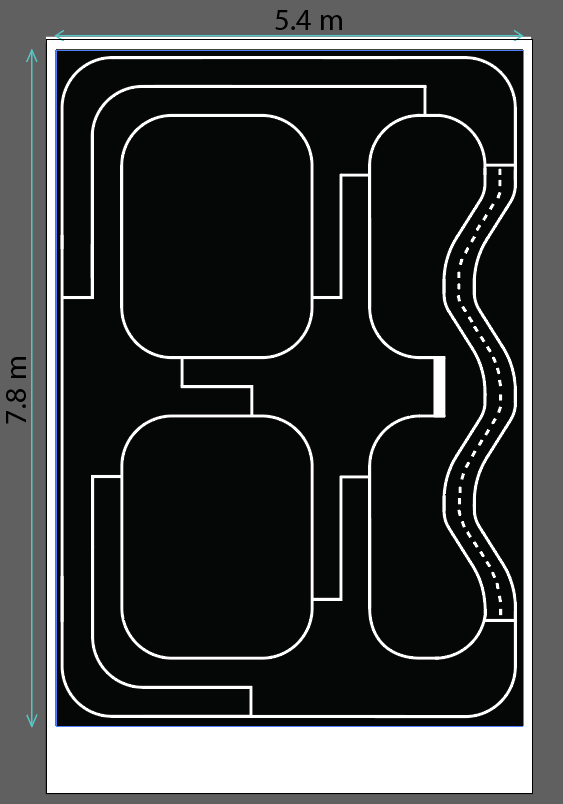

# UIT_Car_Racing_2023
## <div align="center">Final_Map</div>
<p align="center">
 
</p>

## <div align="center">Challenge</div>
### elimination round
 - Ngã ba, Ngã tư gây nhiễu
 - Chạy theo biển báo
### final_round
 - Đường con rắn một lane
 - Đường hai chiều, phải đi lane phải
 - Chạy theo biển báo
 - Đèn giao thông 

## <div align="center">Inference</div>
```
Elimination_round: cd sloai_kdong => python test_client.py
final_round: python3 client.py
```

## <div align="center">Dataset</div>
- [Segmentation](https://github.com/dotrannhattuong/UIT_Car_Racing_2022/tree/main/dataset/segmentation).
- [Object Detection](https://github.com/dotrannhattuong/UIT_Car_Racing_2022/tree/main/dataset/object_detection).

## <div align="center">Training</div>
- [Unet](https://github.com/dotrannhattuong/UIT_Car_Racing_2022/tree/main/notebook/segment).
- [Object Detection](https://github.com/dotrannhattuong/UIT_Car_Racing_2022/tree/main/notebook/object_detection).

## <div align="center">Idea</div>
- Ngã ba, Ngã tư nhiễu => thêm hai line cao và thấp hơn để check giá trị có phù hợp
- Bám lane phải => Phù hợp với label và giúp xe tự cua phải
- Sử dụng màu HSV kết hợp OD để detect ra đèn giao thông
- Ngắt frame để tăng fps
- Sử dụng Unet đã được giảm bớt tham số 
- Áp dụng Linear Function để điều khiển tốc độ
- Sử dụng timer để cua mù trái 
- Sử dụng line ngang để xác định thời điểm cua => cua thành công 100% (xét trong trường hợp detect đúng biển báo)
## <div align="center">References</div>
- CEEC: https://github.com/nphuc0311/UIT_Car_Racing_2023